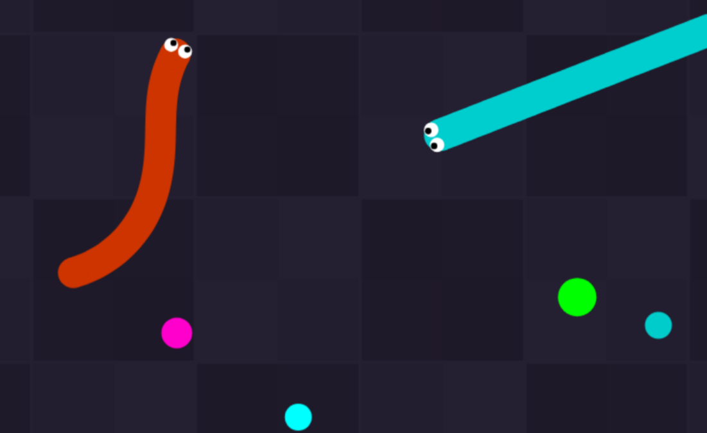

# Slither

[A single player demake of slither.io](https://beauconstrictor.github.io/Slither)

Slither is a barebones static slither.io demake where you play against
bots. If you want to host this game locally, just clone the repo
and open `index.html` in your browser

## License

This game is not licensed. Do whatever you want with it.
